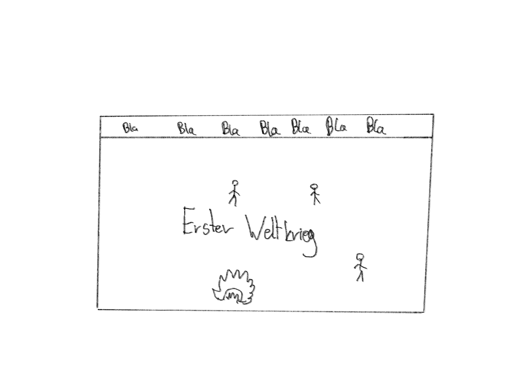

# Info-projekt
### Eine ungenaue Reportage von meiner Arbeit
## Inhalt
1. <a href="#ErsteIdee"> Erste Idee</a></li>
2. <a href="#Tools"> Tools</a>
    1. Github
    2. Procreate
    3. 
3. Design
4. Protokoll

## <a name="ErsteIdee"> Erste Idee</a>

Ich hatte die Idee für das Fach Geschichte eine Website zu machen, mit der man schnell den ersten Welkrieg versteht. Eine konkrete Idee für das Design, hatte ich noch nicht, aber eine Konzept hatte ich schon.

Wie ich die Top Navigation Bar machen sollte, wusste ich noch nicht, aber dies kann man einfach auf w3schools finden. (https://www.w3schools.com/howto/howto_js_topnav.asp) Die Idee ist, dass ganz oben auf der Seite der Anfang des Krieges ist und je weiter man scrollt, desso weiter entwickelt sich der Krieg. 

## <a name="Tools"> Tools</a>

# GitHub

Das praktische an GitHub war, dass ich an meinem iPad, an meinen Pc und an dem Schulcomputer arbeiten konnte und ohne großen Aufwand es Speicher konnte. Außerdem mußt ich mir nicht auf dem Schulcomputer bestimmte Programme runterladen, um dieses Projekt zu bearbeiten, sondern ich konnte einfach den Codespace bei GitHub benutzen.